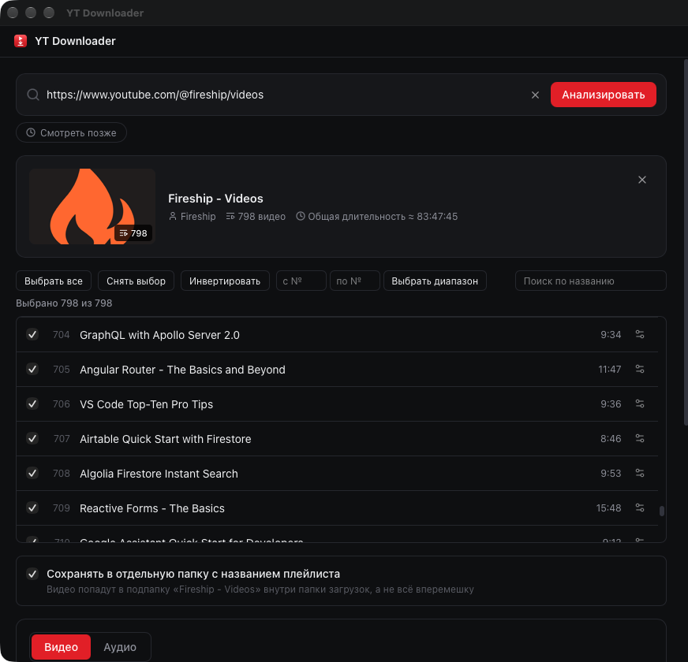
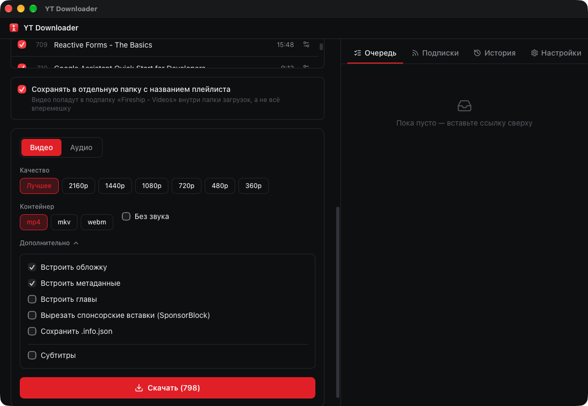

# YT Downloader

Десктопное приложение для скачивания видео, аудио и целых плейлистов с YouTube.
Tauri (Rust) + React + Tailwind CSS. Скачивание выполняет `yt-dlp`, конвертацию/слияние — `ffmpeg`.



## Возможности

### Скачивание
- Вставьте ссылку на видео, плейлист или канал — приложение само определит тип и подтянет
  метаданные. Ссылки-редиректы из Google/Bing и «сломанные» ссылки из мессенджеров
  распознаются; ↑/↓ в строке ссылки листают недавние.
- Видео до 4K (mp4/mkv/webm, можно без звука) или аудио (mp3/m4a/opus/flac/wav, выбор битрейта).
- Встраивание обложки, метаданных, глав и субтитров, вырезание спонсорских вставок
  (SponsorBlock), сохранение `.info.json`.
- Плейлисты: выбор отдельных видео, диапазона номеров, поиск по названию, свой формат для
  отдельного ролика, сохранение в подпапку с названием плейлиста. Уже скачанные видео
  помечены «скачано» и по умолчанию не выбраны.
- Очередь с прогрессом, паузой и докачкой, автоповтором при сбоях, общим лимитом скорости
  на все загрузки и историей.



### «Смотреть позже»
Кнопка под строкой ссылки открывает ваш плейлист «Смотреть позже» как обычный плейлист —
можно выбрать и скачать нужное. Нужны cookies аккаунта (см. ниже).

### Подписки без ленты
Вкладка «Подписки» — чтобы следить за любимыми каналами, не заходя на YouTube:
- каналы добавляются по ссылке (на канал, `@handle` или любое его видео) или импортом
  подписок из аккаунта (нужны cookies);
- «Новое» показывает только видео, вышедшие после прошлой проверки, — без рекомендаций и
  бесконечной ленты; Shorts и трансляции не показываются. При первом добавлении канала
  в «Новое» попадают только видео за последнюю неделю;
- видео можно скачать (как видео или аудио) или пропустить; в браузер приложение ничего
  не открывает;
- для отдельных каналов — автоскачивание: новые видео сразу уходят в очередь;
- фоновая проверка, пока приложение открыто (интервал в настройках), и системное
  уведомление о новых видео.

Каналы проверяются через `yt-dlp` (вкладка «Видео» канала), а не через RSS: YouTube-фиды
`feeds/videos.xml` с осени 2026 отвечают 404.

### Прочее
- Встроенные `yt-dlp`, `ffmpeg`, `ffprobe`, JS-рантайм и PO-token провайдер — ничего не
  нужно ставить отдельно; `yt-dlp` обновляется кнопкой в настройках.
- Прокси, cookies (файл `cookies.txt` или из браузера), шаблон имени файла.
- Тёмная/светлая/системная тема, русский и английский интерфейс.

### Cookies
Нужны для «Смотреть позже», импорта подписок, приватных и 18+ видео. Экспортируйте их
расширением вроде «Get cookies.txt LOCALLY» **в формате Netscape** (не JSON) из приватного
окна, где вы вошли в YouTube, и сразу закройте это окно — иначе YouTube быстро сменит
cookies и экспортированные перестанут работать. Файл укажите в настройках.

## Платформы

Сборки в CI выходят для macOS (Apple Silicon), Windows и Linux (`.dmg`, `.msi`/`.exe`,
`.deb`/`.AppImage` — см. [Releases](../../releases)). **Реально разработано и протестировано
только на macOS** — это единственная система, на которой я запускал и проверял приложение
вживую. Сборки для Windows и Linux собираются в CI и проходят компиляцию/бандлинг, но сам
рантайм (первый запуск, поиск/запуск `yt-dlp`/`ffmpeg`, диалоги, пути к файлам) на этих ОС
не проверялся. Встречаете баг на Windows/Linux — заводите issue.

## Разработка

Требуется Node.js 20+, Rust (через [rustup](https://rustup.rs)).

```bash
npm install
npm run tauri dev
```

## Сборка

```bash
npm run tauri build
```

Готовый `.app`/`.dmg` появится в `src-tauri/target/release/bundle/`.
Бинарники `yt-dlp`/`ffmpeg`/`ffprobe`/`qjs`/`bgutil-pot` в `src-tauri/binaries/` (и плагин
в `src-tauri/pot-plugin/`) не хранятся в репозитории — их подготавливает CI
(см. `.github/workflows/release.yml`) либо нужно положить туда вручную перед локальной
сборкой (при их отсутствии приложение в dev-режиме откатывается на системные версии из
`PATH`/Homebrew, кроме `qjs`/`bgutil-pot` — для них системных путей нет).

## Почему YouTube иногда просит верификацию

С конца 2025 YouTube требует от `yt-dlp` решать JS-челлендж на каждый запрос и предъявлять
proof-of-origin токен на часть форматов — без этого выдаётся `403 Forbidden` или экран
`Sign in to confirm you're not a bot`. Приложение закрывает это без участия пользователя:

- **JS-рантайм** — встроенный `qjs` (quickjs-ng, ~1–2 МБ), решает JS-челлендж вместо
  тяжёлого Deno.
- **PO-token провайдер** — встроенный `bgutil-pot` поднимается локальным HTTP-сервером и
  отдаёт `yt-dlp` токены через плагин в `pot-plugin/`. Не обязателен: если не запустился,
  скачивание продолжает работать как раньше (часть форматов может быть недоступна).

Приложение намеренно **не** переопределяет выбор плеер-клиента YouTube (`player_client`) —
какие клиенты сейчас работают, а какие заблокированы, решает сам `yt-dlp` и это меняется
каждые несколько недель. Зашитый в код список клиентов устаревает быстрее, чем успевает
принести пользу, а иногда и мешает: когда `yt-dlp` сам убрал сломанный `android_vr` из
дефолтных клиентов (2026.07.04 → 2026.08.19), самодельное исключение `android_vr` в старой
версии этого README/кода конфликтовало с апстримным фиксом и оставляло часть видео вообще
без рабочих форматов. Актуальная версия `yt-dlp` — это и есть фикс; кнопка «Обновить yt-dlp»
в настройках обновляет его без переустановки всего приложения.

Если верификация всё равно всплывает — сначала попробуйте обновить `yt-dlp` в настройках,
затем включите cookies (файл `cookies.txt` надёжнее, чем выбор браузера). Экран статуса
зависимостей (JS-рантайм/PO-token) подскажет, что из встроенного не сработало.

Обратное тоже бывает: cookies иногда **ломают** скачивание. С августа 2026 YouTube отвечает
`The page needs to be reloaded.` клиенту `tv_downgraded`, который `yt-dlp` выбирает по
умолчанию как раз при наличии cookies ([yt-dlp#17389](https://github.com/yt-dlp/yt-dlp/issues/17389)),
хотя без cookies то же видео качается нормально. Приложение это отслеживает: если запрос с
cookies падает с такой ошибкой, оно автоматически повторяет его без cookies (и продолжает
уже скачанную часть файла). Видео, которым вход в аккаунт действительно нужен (приватные,
с возрастным ограничением), повтор не спасёт — там ошибка останется прежней.

## Дисклеймер

Приложение предназначено для личного офлайн-доступа к контенту, на который у вас есть права,
или к материалам без ограничений на скачивание. Соблюдение условий использования YouTube и
законодательства об авторском праве — ответственность пользователя.
